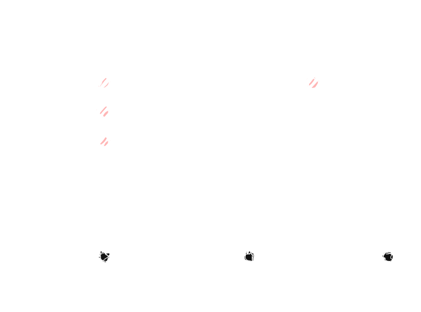

# Requirement Analysis in Software Development

This repository documents the requirement analysis phase for a booking management system, following industry-standard SDLC practices. It demonstrates how to translate business needs into structured technical requirements through clear documentation and visual modeling. The project will showcase functional/non-functional requirements, use cases, and acceptance criteria for a robust booking solution.

## What is Requirement Analysis?

Requirement Analysis is the process of identifying, documenting, and validating what a software system needs to do. It is a crucial first phase in the Software Development Life Cycle (SDLC) because it ensures developers build the right solution for the users' needs.

Key reasons it's important:
- Prevents misunderstandings between stakeholders
- Reduces costly changes later in development
- Provides clear guidelines for designers and programmers
- Helps create accurate timelines and budgets

## Why is Requirement Analysis Important?

1. **Prevents Miscommunication**: Ensures all stakeholders agree on what the system should do.
2. **Reduces Development Costs**: Fixing errors in requirements is cheaper than fixing coded features.
3. **Guides Development**: Provides clear specifications for designers and programmers to follow.

## Key Activities in Requirement Analysis

- **Requirement Gathering**: Collecting needs from stakeholders through interviews, surveys, or workshops.
- **Requirement Elicitation**: Extracting hidden or unstated needs through observation and prototyping.
- **Requirement Documentation**: Recording requirements in clear, structured formats (e.g., SRS documents).
- **Requirement Analysis and Modeling**: Organizing requirements using diagrams (e.g., use cases, flowcharts).
- **Requirement Validation**: Checking requirements for completeness, consistency, and testability.

## Types of Requirements

### Functional Requirements
What the system must do:
- Users can book, modify, and cancel reservations
- Admins can view all bookings in the system
- The system sends confirmation emails

### Non-functional Requirements
How the system performs:
- The system loads search results in under 2 seconds
- User data is encrypted using AES-256
- The system handles 1000 concurrent users

  

## Acceptance Criteria

Acceptance criteria define the conditions a feature must meet to be accepted by stakeholders. They provide clear, testable requirements to ensure development aligns with business needs.

**Example for Checkout Feature**:
1. The system must calculate and display the total price including taxes.
2. Users must receive an email confirmation after successful payment.
3. Payment failures must show an error message within 2 seconds.
